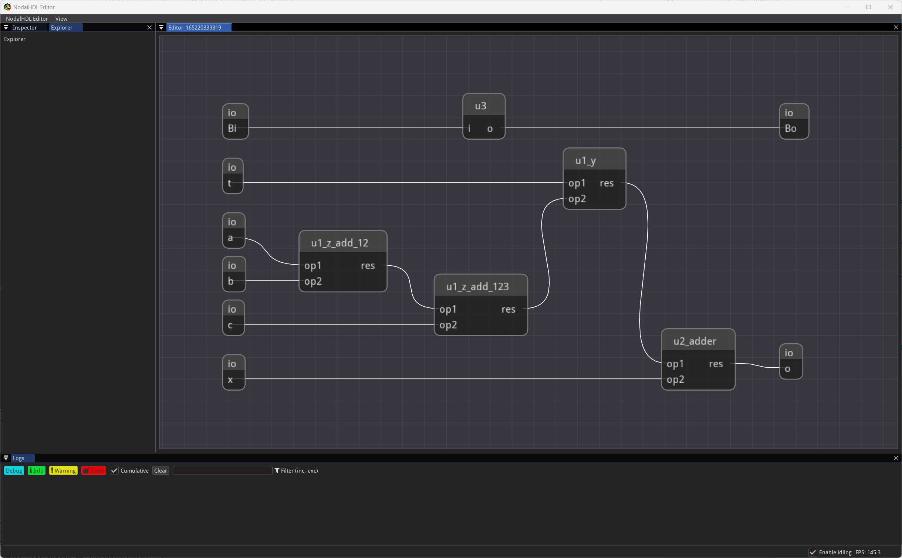

# nodalhdl_editor

## Introduction

**Ongoing**.

只写好了 GUI 框架和预览结构的功能，暂无编辑功能。



## Dependencies

### nodalhdl

暂时建议将 [nodalhdl](https://github.com/Gralerfics/nodalhdl) 克隆到本地后以可编辑模式安装。在 nodalhdl 目录下执行（建议在虚拟环境下）：

```bash
pip install -e . --config-settings editable_mode=compat
```

参数 `--config-settings editable_mode=compat` 用于解决 Pylance（VSCode 中 Python 的语言服务器）无法为 `pip install -e .` 安装的包提供提示的问题，详见 [StackOverflow - Why are PyCharm and Pylance not detecting packages installed in editable mode?](https://stackoverflow.com/questions/76301782/why-are-pycharm-and-pylance-not-detecting-packages-installed-in-editable-mode)。

若未生效可能需要 `Ctrl + Shift + P`（VSCode）后选择 `Python Restart Language Server` 重启。

### imgui-bundle

见 `requirements.txt`。

